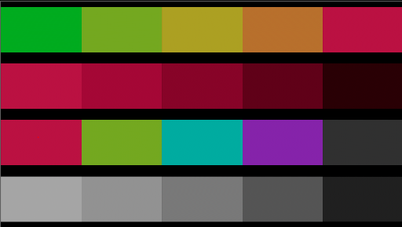
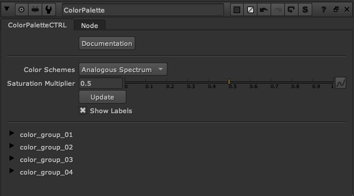
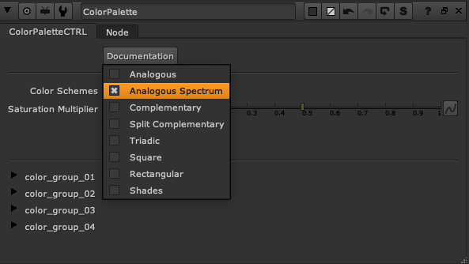
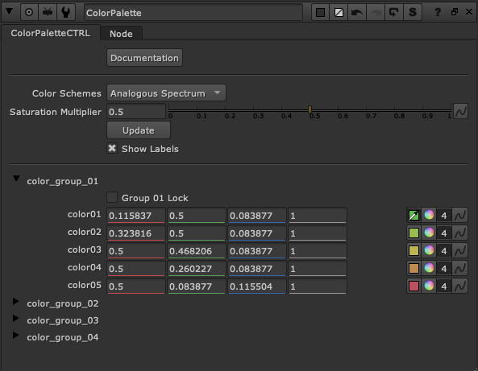
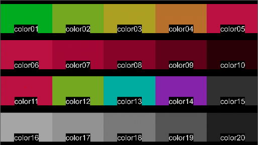

# ColorPalette
## A color palette generation tool for the Foundry's Nuke

### Nuke UI

### Available Color Schemes

- Analogous
- Analogous Spectrum
- Complementary
- Split Complementary
- Triadic
- Square
- Rectangular
- Shades

### Knobs
##### Documentation
A button that opens the main github repo for this project in your default browser.
##### Color Schemes
A dropdown to select which color scheme to generate
##### Saturation Multiplier
For color schemes which generate 2 or 3 colors for the scheme, the remaining 2 are added as desaturated verions of the primaries using this value.
##### Update
Button to trigger updates to any unlocked color groups
##### Select and Lock
There are 5 colors available in each group. Once you've found a scheme you like for a group, toggle the Group lock so that further usage of the Update button doesn't affect it.

### Final Result
